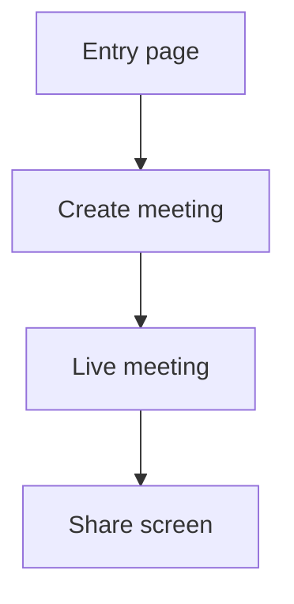

# Frontend Mapping

Use framework components only after the page's visual skeleton has been preserved. Framework colors and tokens may differ from Axure, but component mapping must not move major regions, add generic dashboard chrome, expose hidden states, or create extra wrappers/borders that change the original grouping. If a high-level framework component forces a visibly different structure, style it down or reconstruct the child elements faithfully.

Every framework or custom component choice must reconcile the page's element coverage ledger. A high-level component may cover multiple Axure widgets only when the covered `scriptId`s are listed in the component map with a disposition such as `covered-by-parent` or `library-icon-replacement`. Do not drop labels, input values, options, assets, hidden panel content, or interaction targets because a library component looks cleaner.

## Supported Stacks

Offer exactly these initial choices unless the user asks for more:

1. React + Vite + TypeScript + Ant Design
2. Vue 3 + Vite + TypeScript + Element Plus
3. Vue 3 + Vite + TypeScript + Ant Design Vue

Default to TypeScript only because all supported stack choices are TypeScript. Do not choose a stack, component library, prototype type, entry page, output location, route strategy, conversion scope, responsive targets, or data handling strategy without explicit user confirmation.

## User Choices That Affect Architecture

Ask before implementing whenever a choice affects the generated project shape:

- Whether to convert every Axure page or only selected flows.
- Whether Axure state-variant pages should become routes or component state.
- Whether product routes should be rewritten from business intent or kept close to Axure filenames.
- Whether local typed mock data is enough or a frontend API service layer should be scaffolded.
- Which responsive breakpoints or mobile device widths matter most.
- Whether ambiguous icon-like assets are generic UI icons or product-specific visuals.
- Which page/flow should be implemented first when the prototype is large.

## Initialization

React + Ant Design:

```bash
npm create vite@latest . -- --template react-ts
npm install antd @ant-design/icons
```

For Axure exports with many pages or high layout fidelity risk, install the bundled generic renderer before writing any page-specific React code:

```bash
node <skill-dir>/scripts/install_react_antd_renderer_assets.mjs <output-project-dir>
node <skill-dir>/scripts/build_react_antd_axure_data.mjs <output-project-dir> <axure-export-dir>
```

The renderer maps ledger rows to React/AntD controls from evidence. Improve this scaffold when a failure pattern is generic, such as missing `style.image.path` assets, hidden interaction target descendants, or zero-size interactive groups. Do not patch a single generated page as validation evidence.

The generated Vite TypeScript project must include a complete, buildable scaffold:

- `src/vite-env.d.ts` with `/// <reference types="vite/client" />`.
- Type dependencies required by the selected config, for example `@types/node` when `vite.config.ts` or `tsconfig.node.json` references Node types.
- `tsconfig` files that match installed dependencies; do not reference type packages that are not installed.
- A successful `npm run build` or equivalent typecheck/build before page acceptance.

Vue 3 + Element Plus:

```bash
npm create vite@latest . -- --template vue-ts
npm install element-plus @element-plus/icons-vue
```

Vue 3 + Ant Design Vue:

```bash
npm create vite@latest . -- --template vue-ts
npm install ant-design-vue @ant-design/icons-vue
```

Add routing only when multiple frontend routes are needed:

```bash
npm install react-router-dom
```

or:

```bash
npm install vue-router
```

## Route Rules

Do not preserve Axure page names by default. Derive readable product routes from intent, for example:

- `meeting-runing-default.html` -> `/meeting/live`
- `meeting-share-screen.html` -> `/meeting/share`
- `create-meeting.html` -> `/meetings/new`

Route and component names may be normalized, but visible UI text may not. Menu labels, tab labels, form labels, button labels, and title attributes must come from the current Axure page/state content inventory. Do not rewrite labels into more common product wording unless the user explicitly asks for wording cleanup.

When an Axure page only represents a UI state, implement it as component state instead of a route. Keep a route mapping table in `README.md`.

## Component Mapping

Use the selected library first:

- Buttons, icon buttons, dropdowns, menus, tabs, segmented controls, inputs, selects, checkboxes, radios, switches, uploaders, tooltips, popovers, modals, drawers, tables, pagination, forms, date/time pickers, alerts, tags, avatars, breadcrumbs, layout shells.
- Replace Axure-generated generic UI icons with library icons when the semantics match. Keep custom SVG/PNG assets for brand-specific, product-specific, content-specific, or no-library-equivalent icons.
- Treat small `vectorShape` SVG assets as icon candidates, not image/content assets. Axure may export these SVG paths with page-coordinate transforms that render as blank images inside Vite; infer the icon role from neighboring text, enclosing button labels, topbar order, labels, and actions, then render the selected framework icon. A white/gray square is not an acceptable icon fallback.
- For collapsed icon-only sidebars, infer icon roles from `linkWindow` targets and stable slot order before falling back to neighboring text. Repeated menu icons must not all become one generic framework icon.
- Implement custom components for dynamic panels, specialized media surfaces, canvas-like areas, timeline views, multi-state overlays, or any behavior the library cannot express cleanly.

Do semantic component inference before coding:

- Axure primitives are not frontend components. Rectangles, labels, images, vectors, and groups can represent buttons, menu items, tabs, toolbars, upload controls, row actions, close controls, or route links.
- A widget with events is never "just decorative" until its event script is parsed. Inspect `interactionMap` and action order first, then choose the frontend component by product intent.
- A small SVG/vector widget with a click action that hides a panel/dialog is a close IconButton even when it has no text or neighboring label. Render it with the framework close icon and preserve the hide action.
- Upgrade low-level Axure composites to usable framework controls when the product intent is clear. A text field paired with a calendar icon and date-formatted value maps to DatePicker/Calendar. A label-like clickable rectangle maps to Button/Link. A label/icon/drop area maps to Upload. The resulting frontend control must be operable, not only visually similar.
- Preserve direct Axure control types by source context. A `textBox` remains an Input-like component, a `checkbox` remains a Checkbox-like component, a `radioButton` remains a Radio-like component, and a `comboBox` remains a Select-like component unless a documented Axure composite clearly upgrades it, such as date text field plus calendar icon to DatePicker. These must be real framework controls with local checked/value state and event wiring, not native read-only inputs or static visual lookalikes. Always inspect option-group evidence such as exported input `name`, group name, selection group, and grouped selected-state actions before rendering buttons, radio buttons, or checkboxes.
- Repeated page chrome plus `linkWindow` targets usually indicates an app shell. Convert copied Axure sidebars/topbars into a shared layout with route content, not duplicated per-page markup.
- A unique shell page with top/left navigation plus an Axure `inlineFrame` usually indicates a real app layout with embedded feature pages. Keep that shell as the frontend entry route, render prototype-page frame targets as child routes/components, and execute `linkFrame` actions by changing the embedded route target.
- Axure often places sidebar/menu click handlers on zero-size or transparent groups while the visible rectangle/SVG icon is a sibling or child slot. Transfer the group's `onClick`/`linkWindow` actions to the visible slot bounds; never leave the event on a 0x0 element.
- Repeated selectable labels/groups that set selected state or switch panel states usually indicate tabs, segmented controls, side settings navigation, or menu groups.
- Label/input/select/checkbox clusters inside a coherent region usually indicate a form. Compact clusters above tables/lists usually indicate a toolbar or filter bar.
- Image/icon/label/drop-zone clusters with upload wording or upload-like events usually indicate an upload component, even when Axure did not use a native upload control.
- Hidden dynamic panels with overlays, close icons, and show/hide actions usually indicate modals, drawers, popovers, confirmations, or generated information panels.
- Nested confirmation dialogs/panels inside a fixed parent dialog must stay in the parent's fixed coordinate system. Do not drop back to page-canvas coordinates just because the inner panel itself is `position:absolute`.
- Repeater and table item templates must be mapped as full row/list components, preserving checkboxes, radios, status icons, avatars, row actions, and selected states.

### Axure Primitive Mapping Table

Use this table as the first-pass component mapping, then refine with events, neighboring widgets, style, and rendered behavior:

| Axure evidence | Frontend mapping |
| --- | --- |
| `checkbox` | Framework Checkbox or Checkbox.Group when option-group evidence exists, preserving checked/disabled state, clickability, local state, events, and any Axure-proven outer option container |
| `radioButton` | Framework Radio or Radio.Group, preserving selected state, clickability, local state, option-group mutual exclusion, grouping intent, and events |
| button widget / primary button / button-like rectangle or group | Button/IconButton, or Segmented/Tabs/controlled button group when option-group evidence exists, preserving exact visible label, icon, size, fill, selected state, group constraint, and action; child text/icon/background widgets must proxy the parent button event |
| `label`, heading, paragraph without events | Typography/text element (`span`, `p`, `h1`, `h2`, `h3`) with original text/style |
| `label`, heading, rectangle, image, icon, or group with `interactionMap` | Interactive component determined from action: Button, Link, MenuItem, Tab, IconButton, Upload trigger, row action, etc. |
| `imageBox`, placeholder, snapshot, product/content image | Image component using copied Axure asset |
| `textBox` / text input | Input family component based on input subtype |
| `comboBox`, droplist, list box | Select/Listbox, preserving options and default value |
| table widget | Table, preserving cell text, row/column grouping, and fixed/flexible widths |
| repeater | Typed data array plus framework List/ListItem by default, preserving template controls; when Axure wrap/grid is enabled, use framework grid-list/list-grid semantics; upgrade to Table/Card only with source evidence |
| `inlineFrame` pointing at another exported prototype page | Embedded route outlet/component container, preserving frame bounds and `linkFrame` navigation |
| hidden dynamic panel with close/confirm/overlay/fixed position/show action | Modal/Dialog/Drawer/Popover according to behavior |

### Text Input Subtypes

Inspect Axure metadata, exported HTML attributes, labels, icons, and events before choosing the frontend input:

| Axure/HTML input type or evidence | Frontend mapping |
| --- | --- |
| text | Input |
| password | Password Input |
| number | InputNumber or numeric Input |
| Email/email | Email Input |
| Phone number/tel | Telephone Input |
| URL/url | URL Input |
| search or search icon/event | Search Input |
| file or upload/drop-zone evidence | Upload/File picker |
| date or date value + calendar icon/event | DatePicker |
| month | MonthPicker or DatePicker configured for month |
| time | TimePicker |

If the chosen frontend library lacks an exact specialized component, use the nearest supported component and document the approximation.

### Component Fallback

If a composite cannot be confidently identified after checking widget type, HTML attributes, events, neighboring labels/icons, style, and rendered behavior, do not invent a high-level component. Reconstruct the original visible child elements faithfully, preserving text, assets, child order, grouping, borders, fills, and state. This fallback is preferred over a wrong framework component.

Fallback reconstruction still must mark every relevant coverage-ledger row as implemented. If an Axure group or dynamic panel is implemented as one frontend component, record the child `scriptId`s covered by that component so validation can distinguish intentional grouping from element loss.

## Style And Data Matching For Framework Components

Framework components must be styled from Axure evidence, not left at library defaults:

- DatePicker/Input/Select: preserve prototype value formats, option text, dimensions, icon placement/color, border color, background, and disabled/read-only behavior. Validate the calendar/dropdown opens when the control should be usable.
- Checkbox/Radio: preserve selected state, clickability, option-group constraints, check mark color, box size, label spacing, and any surrounding Axure container rectangles. Do not render these as `readOnly` native inputs or static SVG lookalikes. Use the selected framework's Checkbox/Radio components, keep their state in the restored frontend, and run Axure click/change events after state updates. Radio buttons with the same Axure option group must be mutually exclusive through `Radio.Group` or equivalent controlled state. Do not add a library-default colored checkbox or extra border when the Axure SVG/CSS uses a different appearance. Scope CSS to the intended frontend wrapper so internal library labels/spans are not accidentally styled as new Axure containers.
- Checkbox/Radio labels must remain inline when the Axure label is inline, even if the exported control bounds are only just large enough for the native control plus text. Do not let component-library internal spans wrap, clip, or become separate Axure-like labels.
- Button/IconButton: preserve visible label, icon, size, shape, fill, border, and placement. If the Axure button text is `分享`, do not rename it from the event target or inferred action.
- Axure `button` widgets are behavior anchors. If the button is exported as a parent group with child label/icon/background widgets, implement the parent as the click source and make all visible non-control descendants share or proxy that source event. A click that works only on an invisible parent layer but not on the visible label/icon is an event restoration failure.
- Transparent shape fills are background opacity, not whole-widget opacity. If a button or label has `fill.opacity: 0`, keep the text/event visible unless the HTML visibility state says the widget is hidden.
- Hidden/dynamic panels: preserve exact exported text and data rows from the hidden panel subtree. Use the panel's coordinate groups to infer columns and action placement before applying responsive CSS.
- Sidebar/menu chrome: preserve exact visible labels/title attributes, item count/order, icon order, selected marker, separators, collapse/expand affordance, and collapsed/expanded widths from the page code and CSS. Build a canonical menu from event-bearing Axure groups, descendant text in expanded variants, slot y-order, selected states, and `linkWindow` targets before rendering any shared component. A generic library menu is acceptable only after it is styled to match those facts.
- When the same sidebar appears on multiple pages with collapsed and expanded variants, consolidate it from repeated rail bounds, slot y-order, ancestor groups, descendant labels, selected states, separators, and `linkWindow` targets. A collapsed slot whose local action is only `set selected` must inherit the matching expanded slot's label/route when evidence exists, such as `系统设置 -> meeting-setup.html`. Treat the original per-page widgets as covered by the shared chrome component.
- Do not use slot-order fallback to invent menu modules. Labels such as `系统帮助`, `系统设置`, and `在线客服` must come from source text or action targets; unknown slots must be flagged in the shared-chrome ledger rather than rendered as unrelated roles such as `team` or `video`.

### CSS Scope Safety

Framework components contain their own internal spans, labels, inputs, wrappers, and SVGs. Avoid broad selectors such as `label > span`, `.panel span`, `.form label`, or `.ant-*` rules that apply across an entire page unless the Axure evidence requires global behavior.

Use explicit wrapper classes for restored Axure form labels and option blocks. Validate after styling that:

- Checkbox and radio label text remains inline when the Axure label is inline.
- Select, DatePicker, Input, and Button widths match the layout ledger instead of shrinking to content.
- Form label styling does not leak into component-library internal markup.
- Component-library wrappers do not create extra rows, borders, or spacing not present in Axure.

## Asset Implementation

Use real non-icon assets from the Axure export:

- Copy SVG, PNG, JPG, JPEG, GIF, WebP, ICO, and font files used by implemented pages when they are content, brand, avatar, screenshot, diagram, product-specific icon, or otherwise not a generic UI icon.
- Use the selected frontend icon library for generic UI icons when an equivalent exists; do not copy Axure icon images just to reproduce generic controls.
- Do not use placeholder images, gray boxes, fake avatars, fake logos, or generated substitute artwork when the original export contains a non-icon asset.
- For React/Vite, prefer imports from `src/assets/axure/...` for component-local assets and `public/axure-assets/...` for URL-style references.
- For Vue/Vite, prefer the same `src/assets/axure/...` or `public/axure-assets/...` split.
- Preserve source-page folder names where useful for traceability.
- Document missing non-icon assets and meaningful library-icon replacements in `README.md`.

## Behavior Implementation

Implement Axure scripts as typed frontend behavior:

- React: use component state, reducers, derived selectors, controlled inputs, effect hooks, and router actions.
- Vue: use refs/reactive state, computed values, watchers only when needed, controlled form bindings, and router actions.
- Keep event handlers named after product intent, not Axure widget IDs.
- Preserve action ordering when it matters: condition -> state update -> visibility/panel update -> navigation/side effect.
- For Axure `fadeWidget` visibility actions, infer show versus hide from the action description/target intent, not from generic labels such as `显示/隐藏`.
- Model global variables as app state only when they cross page boundaries; otherwise keep state local to the page/component.
- Convert hover/selected/focused/disabled style states into component props, CSS states, or class bindings.
- Convert waits and animation durations into user-meaningful transitions. Avoid carrying Axure playback timing when it is only an authoring artifact.
- Implement repeater sort/filter/pagination/dataset mutation as local typed state unless the user asks for backend integration.
- Implement raised/fire events as callback props, event emitters, or shared handlers according to framework conventions.
- Implement `linkFrame` as embedded route/content state when the frame target is an exported prototype page. Preserve the source button/menu item's click handler and update only the targeted inline frame, not the whole browser route unless the prototype action is `linkWindow`.
- Implement adaptive views as responsive CSS/component layout. Use explicit breakpoints when Axure view sets encode distinct screen layouts.

## Special Axure Features

Dynamic panels:

- Model panel states with typed state variables.
- Treat only the exported default/active panel state as initially visible. Preserve inactive state descendants in the ledger for later interactions, but never render multiple sibling `Axure:PanelDiagram` states at the same time.
- When a hidden dynamic panel is shown, reveal only that panel's active state subtree. Nested hidden dynamic panels inside it must remain hidden until their own show action runs.
- Preserve exported overlay positioning. A dynamic panel with `position: fixed`, `left/top: 50%`, `margin-left/top`, pin-to-browser, lightbox, or bring-to-front evidence must render as a fixed high-z-index overlay/dialog/popover at that geometry, not at its stale canvas `style.location` coordinates.
- Map state changes to tabs, segmented controls, drawers, modals, conditional panels, or state machines.
- Preserve show/hide, lightbox, and bring-to-front effects as modal/drawer/popover behavior.

Repeaters:

- Extract data into typed arrays.
- Preserve all prototype rows.
- Treat Axure `repeater/中继器` as a framework List/ListItem data component by default. Do not mechanically explode it into labels, and do not map it to Table unless table-like evidence exists.
- Always inspect Axure repeater properties before choosing the frontend list variant. If the Axure author enabled the wrap/grid option (`repeaterPropMap.wrap > 1` with horizontal flow / `vertical === false`), restore it as the selected framework's grid-list/list-grid variant, such as AntD `List` with grid semantics or an equivalent Element Plus grid list, while preserving the Axure item width, item height, horizontal spacing, vertical spacing, and wrap count.
- Upgrade a repeater to Table only when source evidence shows table semantics such as headers, aligned multi-column row fields, sortable/filterable columns, row selection, or table-like borders. Upgrade to Card only when the item template is card-like; a wrapped repeater is still a list grid unless table/card evidence exists.
- Convert `onBeforeItemLoad` binding into render functions, computed fields, or table column renderers.
- Use repeater item-template widget bounds as column/row geometry. Template child widgets are covered by the repeater renderer and must not leak as a single static row.
- Preserve the repeater item template as a template, not as a flattened row. Child controls such as radio buttons, checkboxes, icons, background rectangles, and nested action groups must render inside each repeated item at their Axure x/y/width/height. Repeater-template radio buttons and checkboxes must still be framework Radio/Checkbox components with row/item state and Axure option-group constraints, not read-only native inputs.
- Preserve `repeaterPropMap` layout: item width/height, `wrap`, vertical/horizontal flow, horizontal spacing, vertical spacing, fit-to-content, isolate radio, and isolate selection. A wrapped Axure repeater must restore as a framework multi-column/multi-row grid list, not a single vertical list.
- Preserve template child style attributes including font size, font weight, color, fill, border, radius, text alignment, and vertical alignment. If the generated list loses the source's `12px`/`14px` hierarchy, it is a repeater-template restoration failure.
- Preserve repeater row actions such as update rows, mark/unmark rows, delete rows, filter/sort, set text, and set panel state when present in the template widgets.
- Do not invent backend calls unless requested.

Tables and lists:

- Fixed-width columns: icons, checkboxes, status, row actions, dates/times with known format, short IDs.
- Flexible columns: names, titles, descriptions, emails, addresses, long text, and user-generated content.
- Do not distribute every column equally. Use `minWidth`, `width`, `flex`, horizontal scroll, or responsive stacking according to the selected library and viewport.
- Do not introduce a local horizontal or vertical scrollbar unless the Axure widget, CSS, or rendered baseline shows local scrolling. If the source list/table has no local scrollbar at the reference viewport, the restored list/table must fit or clip inside the same region without framework-generated scrollbars.
- Preserve list/table column x positions, width proportions, row height, and text alignment from the Axure template/header widgets. If the source column geometry exceeds the restored container, proportionally constrain the columns to the source container before considering horizontal scrolling.
- AntD/Element list and table defaults are not layout evidence. Remove default `min-width`, padding, row display, or overflow behavior when it conflicts with the Axure bounds and scroll model.

Inline frames:

- Use an `iframe` only for genuine embedded external or document content.
- Convert prototype-page embeds to components/routes when they are part of the same app.
- When a shell page contains an `inlineFrame` whose default or click targets are exported Axure pages, treat the frame as a content outlet. The shell owns the topbar/sidebar; the embedded page owns only its functional content. Frame navigation must preserve the shell and should be validated by clicking every `linkFrame` source with a recoverable target.

Forms:

- Use library form components and preserve labels, placeholders, defaults, disabled states, validation hints, and submit/cancel behavior visible in the prototype.

## Responsive Layout

Convert Axure absolute layout into responsive structure:

- Web prototypes: identify app shell, header, sidebar, toolbar, content, table/list regions, and dialogs; use flex/grid and component layout primitives.
- Mobile prototypes: preserve mobile-first viewport, bottom navigation, touch target sizes, safe spacing, and vertical flow.
- Keep visual hierarchy and relative placement highly similar, but avoid fixed canvas-size output.
- Use breakpoints only where the prototype's structure requires adaptation.

## Project README

The generated `README.md` must include:

- Stack and component library.
- Axure source directory and entry page.
- Route mapping table.
- Page flow Mermaid diagram.
- Page-internal event/action/condition diagrams or descriptions.
- Component mapping notes.
- Asset copy summary and missing asset notes.
- Validation checklist.

Example flow block:



## Validation Criteria

Treat conversion as successful only when:

- Layout is highly similar while responsive.
- Page route coverage is basically complete.
- Element coverage is reconciled for every selected page: no initially visible widget, control, asset widget, interaction source, or hidden interaction target is missing without an approved omission.
- Prototype data is complete and unchanged.
- Prototype non-icon visual assets are copied and used; generic UI icons may be replaced by framework icons; no existing non-icon Axure image asset is replaced by a placeholder.
- Shared sidebars/topbars are consolidated when repeated across pages, their visible slots remain clickable, and icon-only menu items use distinct framework icons inferred from source events/routes.
- Key interactions are operable.
- Event scripts, conditions, variables, and state styles with product meaning are represented in frontend behavior.
- Component library replacements are maximized.
- Custom implementations cover unsupported Axure behavior.
- Tables/lists use content-aware widths.
- The output is not a fixed-size Axure canvas recreation.
