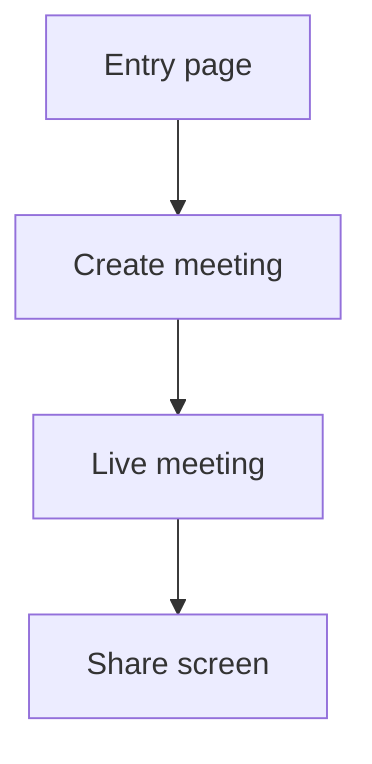

# Frontend Mapping

## Supported Stacks

Offer exactly these initial choices unless the user asks for more:

1. React + Vite + TypeScript + Ant Design
2. Vue 3 + Vite + TypeScript + Element Plus
3. Vue 3 + Vite + TypeScript + Ant Design Vue

Default to TypeScript only because all supported stack choices are TypeScript. Do not choose a stack, component library, prototype type, entry page, output location, route strategy, conversion scope, responsive targets, or data handling strategy without explicit user confirmation.

## User Choices That Affect Architecture

Ask before implementing whenever a choice affects the generated project shape:

- Whether to convert every Axure page or only selected flows.
- Whether Axure state-variant pages should become routes or component state.
- Whether product routes should be rewritten from business intent or kept close to Axure filenames.
- Whether local typed mock data is enough or a frontend API service layer should be scaffolded.
- Which responsive breakpoints or mobile device widths matter most.
- Whether ambiguous icon-like assets are generic UI icons or product-specific visuals.
- Which page/flow should be implemented first when the prototype is large.

## Initialization

React + Ant Design:

```bash
npm create vite@latest . -- --template react-ts
npm install antd @ant-design/icons
```

Vue 3 + Element Plus:

```bash
npm create vite@latest . -- --template vue-ts
npm install element-plus @element-plus/icons-vue
```

Vue 3 + Ant Design Vue:

```bash
npm create vite@latest . -- --template vue-ts
npm install ant-design-vue @ant-design/icons-vue
```

Add routing only when multiple frontend routes are needed:

```bash
npm install react-router-dom
```

or:

```bash
npm install vue-router
```

## Route Rules

Do not preserve Axure page names by default. Derive readable product routes from intent, for example:

- `meeting-runing-default.html` -> `/meeting/live`
- `meeting-share-screen.html` -> `/meeting/share`
- `create-meeting.html` -> `/meetings/new`

Route and component names may be normalized, but visible UI text may not. Menu labels, tab labels, form labels, button labels, and title attributes must come from the current Axure page/state content inventory. Do not rewrite labels into more common product wording unless the user explicitly asks for wording cleanup.

When an Axure page only represents a UI state, implement it as component state instead of a route. Keep a route mapping table in `README.md`.

## Component Mapping

Use the selected library first:

- Buttons, icon buttons, dropdowns, menus, tabs, segmented controls, inputs, selects, checkboxes, radios, switches, uploaders, tooltips, popovers, modals, drawers, tables, pagination, forms, date/time pickers, alerts, tags, avatars, breadcrumbs, layout shells.
- Replace Axure-generated generic UI icons with library icons when the semantics match. Keep custom SVG/PNG assets for brand-specific, product-specific, content-specific, or no-library-equivalent icons.
- Implement custom components for dynamic panels, specialized media surfaces, canvas-like areas, timeline views, multi-state overlays, or any behavior the library cannot express cleanly.

Do semantic component inference before coding:

- Axure primitives are not frontend components. Rectangles, labels, images, vectors, and groups can represent buttons, menu items, tabs, toolbars, upload controls, row actions, close controls, or route links.
- A widget with events is never "just decorative" until its event script is parsed. Inspect `interactionMap` and action order first, then choose the frontend component by product intent.
- Upgrade low-level Axure composites to usable framework controls when the product intent is clear. A text field paired with a calendar icon and date-formatted value maps to DatePicker/Calendar. A label-like clickable rectangle maps to Button/Link. A label/icon/drop area maps to Upload. The resulting frontend control must be operable, not only visually similar.
- Preserve direct Axure control types by source context. A `textBox` remains an Input-like component, a `checkbox` remains a Checkbox-like component, a `radioButton` remains a Radio-like component, and a `comboBox` remains a Select-like component unless a documented Axure composite clearly upgrades it, such as date text field plus calendar icon to DatePicker.
- Repeated page chrome plus `linkWindow` targets usually indicates an app shell. Convert copied Axure sidebars/topbars into a shared layout with route content, not duplicated per-page markup.
- Repeated selectable labels/groups that set selected state or switch panel states usually indicate tabs, segmented controls, side settings navigation, or menu groups.
- Label/input/select/checkbox clusters inside a coherent region usually indicate a form. Compact clusters above tables/lists usually indicate a toolbar or filter bar.
- Image/icon/label/drop-zone clusters with upload wording or upload-like events usually indicate an upload component, even when Axure did not use a native upload control.
- Hidden dynamic panels with overlays, close icons, and show/hide actions usually indicate modals, drawers, popovers, confirmations, or generated information panels.
- Repeater and table item templates must be mapped as full row/list components, preserving checkboxes, radios, status icons, avatars, row actions, and selected states.

## Style And Data Matching For Framework Components

Framework components must be styled from Axure evidence, not left at library defaults:

- DatePicker/Input/Select: preserve prototype value formats, option text, dimensions, icon placement/color, border color, background, and disabled/read-only behavior. Validate the calendar/dropdown opens when the control should be usable.
- Checkbox/Radio: preserve selected state, check mark color, box size, label spacing, and any surrounding Axure container rectangles. Do not add a library-default colored checkbox or extra border when the Axure SVG/CSS uses a different appearance. Scope CSS to the intended frontend wrapper so internal library labels/spans are not accidentally styled as new Axure containers.
- Button/IconButton: preserve visible label, icon, size, shape, fill, border, and placement. If the Axure button text is `分享`, do not rename it from the event target or inferred action.
- Hidden/dynamic panels: preserve exact exported text and data rows from the hidden panel subtree. Use the panel's coordinate groups to infer columns and action placement before applying responsive CSS.
- Sidebar/menu chrome: preserve exact visible labels/title attributes, item count/order, icon order, selected marker, separators, collapse/expand affordance, and collapsed/expanded widths from the page code and CSS. A generic library menu is acceptable only after it is styled to match those facts.

## Asset Implementation

Use real non-icon assets from the Axure export:

- Copy SVG, PNG, JPG, JPEG, GIF, WebP, ICO, and font files used by implemented pages when they are content, brand, avatar, screenshot, diagram, product-specific icon, or otherwise not a generic UI icon.
- Use the selected frontend icon library for generic UI icons when an equivalent exists; do not copy Axure icon images just to reproduce generic controls.
- Do not use placeholder images, gray boxes, fake avatars, fake logos, or generated substitute artwork when the original export contains a non-icon asset.
- For React/Vite, prefer imports from `src/assets/axure/...` for component-local assets and `public/axure-assets/...` for URL-style references.
- For Vue/Vite, prefer the same `src/assets/axure/...` or `public/axure-assets/...` split.
- Preserve source-page folder names where useful for traceability.
- Document missing non-icon assets and meaningful library-icon replacements in `README.md`.

## Behavior Implementation

Implement Axure scripts as typed frontend behavior:

- React: use component state, reducers, derived selectors, controlled inputs, effect hooks, and router actions.
- Vue: use refs/reactive state, computed values, watchers only when needed, controlled form bindings, and router actions.
- Keep event handlers named after product intent, not Axure widget IDs.
- Preserve action ordering when it matters: condition -> state update -> visibility/panel update -> navigation/side effect.
- Model global variables as app state only when they cross page boundaries; otherwise keep state local to the page/component.
- Convert hover/selected/focused/disabled style states into component props, CSS states, or class bindings.
- Convert waits and animation durations into user-meaningful transitions. Avoid carrying Axure playback timing when it is only an authoring artifact.
- Implement repeater sort/filter/pagination/dataset mutation as local typed state unless the user asks for backend integration.
- Implement raised/fire events as callback props, event emitters, or shared handlers according to framework conventions.
- Implement adaptive views as responsive CSS/component layout. Use explicit breakpoints when Axure view sets encode distinct screen layouts.

## Special Axure Features

Dynamic panels:

- Model panel states with typed state variables.
- Map state changes to tabs, segmented controls, drawers, modals, conditional panels, or state machines.
- Preserve show/hide, lightbox, and bring-to-front effects as modal/drawer/popover behavior.

Repeaters:

- Extract data into typed arrays.
- Preserve all prototype rows.
- Convert `onBeforeItemLoad` binding into render functions, computed fields, or table column renderers.
- Do not invent backend calls unless requested.

Tables and lists:

- Fixed-width columns: icons, checkboxes, status, row actions, dates/times with known format, short IDs.
- Flexible columns: names, titles, descriptions, emails, addresses, long text, and user-generated content.
- Do not distribute every column equally. Use `minWidth`, `width`, `flex`, horizontal scroll, or responsive stacking according to the selected library and viewport.

Inline frames:

- Use an `iframe` only for genuine embedded external or document content.
- Convert prototype-page embeds to components/routes when they are part of the same app.

Forms:

- Use library form components and preserve labels, placeholders, defaults, disabled states, validation hints, and submit/cancel behavior visible in the prototype.

## Responsive Layout

Convert Axure absolute layout into responsive structure:

- Web prototypes: identify app shell, header, sidebar, toolbar, content, table/list regions, and dialogs; use flex/grid and component layout primitives.
- Mobile prototypes: preserve mobile-first viewport, bottom navigation, touch target sizes, safe spacing, and vertical flow.
- Keep visual hierarchy and relative placement highly similar, but avoid fixed canvas-size output.
- Use breakpoints only where the prototype's structure requires adaptation.

## Project README

The generated `README.md` must include:

- Stack and component library.
- Axure source directory and entry page.
- Route mapping table.
- Page flow Mermaid diagram.
- Page-internal event/action/condition diagrams or descriptions.
- Component mapping notes.
- Asset copy summary and missing asset notes.
- Validation checklist.

Example flow block:



## Validation Criteria

Treat conversion as successful only when:

- Layout is highly similar while responsive.
- Page route coverage is basically complete.
- Prototype data is complete and unchanged.
- Prototype non-icon visual assets are copied and used; generic UI icons may be replaced by framework icons; no existing non-icon Axure image asset is replaced by a placeholder.
- Key interactions are operable.
- Event scripts, conditions, variables, and state styles with product meaning are represented in frontend behavior.
- Component library replacements are maximized.
- Custom implementations cover unsupported Axure behavior.
- Tables/lists use content-aware widths.
- The output is not a fixed-size Axure canvas recreation.
